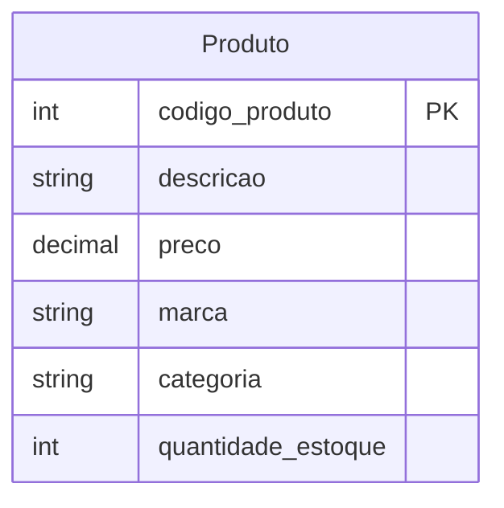

# teste-aula
Aula
teste aula

# 1-  Introdução 

# 2-  Descrição do sistemas 

# 3-  Visão Geral do sistemas 

# 4-  Diagrama ER 

```mermaid

erDiagram
    Produto {
        int codigo_produto PK
        string descricao
        decimal preco
        string marca
        string categoria
        int quantidade_estoque
    }
```